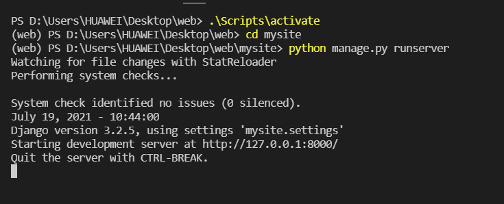

#### 步骤

1、首先确保自己有python运行环境

2、可用Windows cmd / powershell / vscode terminal打开当前文件夹路径

3、执行如下指令启动虚拟环境：

```
./Scripts/activate
```

4、进入项目文件夹/mysite

```
cd mysite
```

5、启动项目：

```
python manage.py runserver
```




